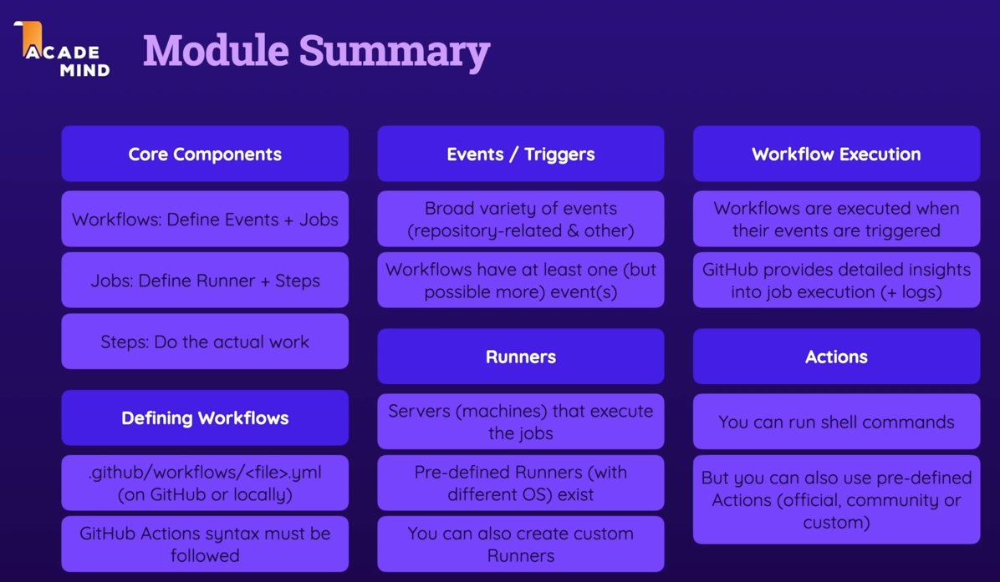
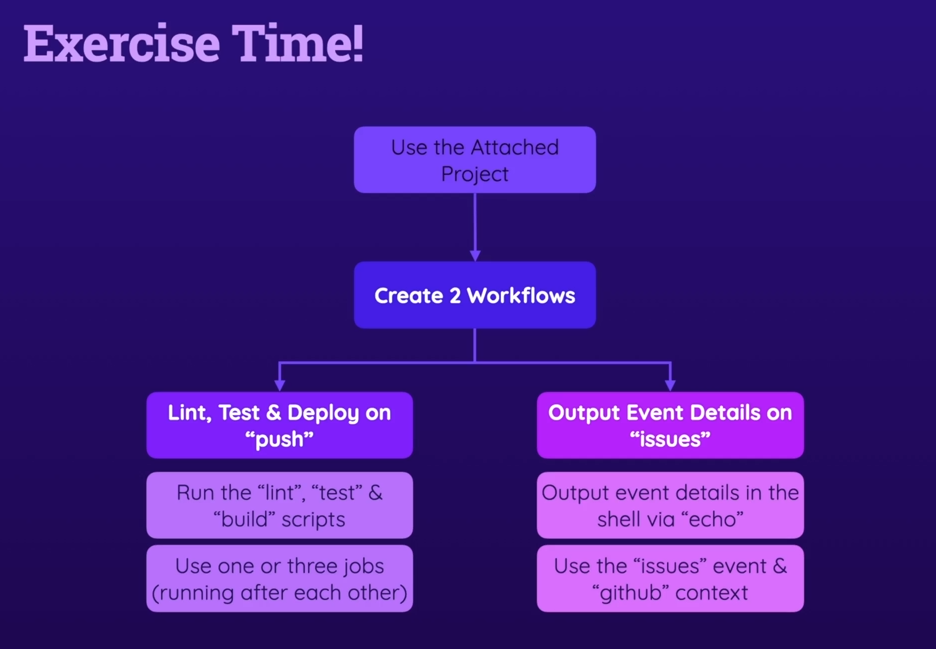
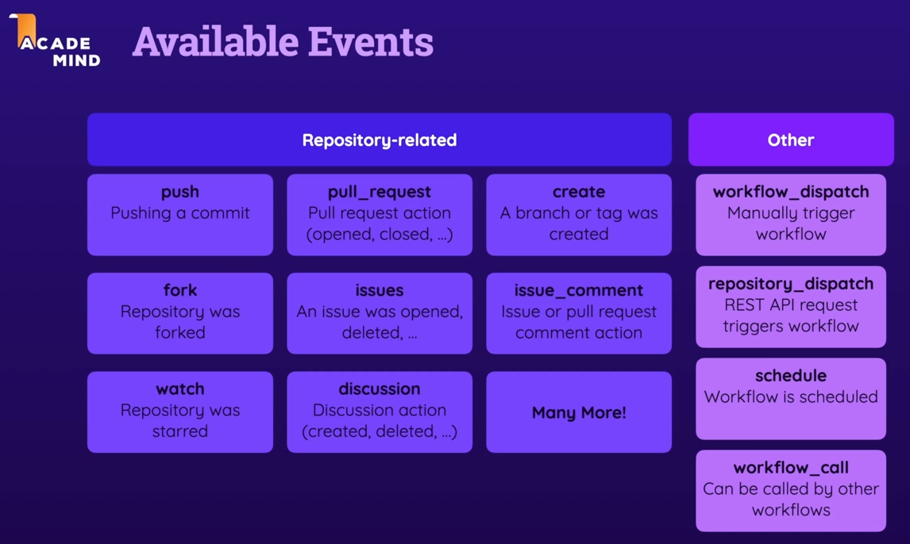

# Github Actions

# github available events
- https://docs.github.com/en/actions/reference/events-that-trigger-workflows

# github action checkout
- https://github.com/actions/checkout

# Configuring a workflow to run manually
```
on: workflow_dispatch
```

# github action contexts
- https://docs.github.com/en/actions/reference/contexts-reference

# Module Summary


# Exercise Time


# Available Events
- https://docs.github.com/en/actions/reference/events-that-trigger-workflows

